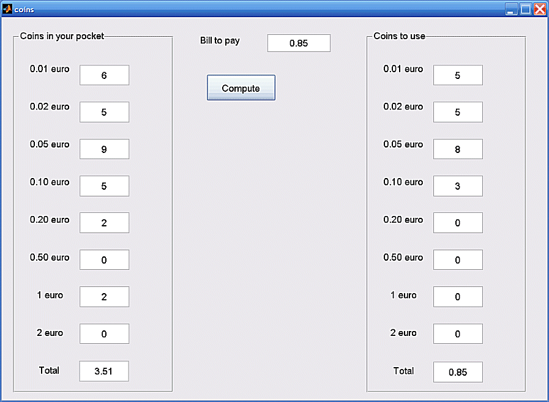

# coins

## 📘 Overview
coins is a MATLAB GUIDE-based GUI that helps you find an effective way to pay an amount using the coins you have in your pocket.  
It is inspired by the ideas described in “L'algoritmo del parcheggio” by Prof. Furio Honsell and focuses on selecting a coin combination that follows a practical strategy using the available denominations.

This tool is intended for everyday reasoning about change-making with limited, real-world coin availability.

## 🧩 Important note about the GUI
This project relies on a companion MATLAB GUIDE file:

- coins.m
- coins.fig

The GUI will work correctly only if coins.fig is present in the same folder (or on the MATLAB path) together with coins.m.

## ✨ Features
- Simple input of available coin quantities for standard Euro denominations
- Input of the amount to pay
- Automatic computation of a suggested coin combination from your pocket
- Displays:
  - total money available
  - number of coins used per denomination
  - total value of coins used
- Reset button to quickly start a new scenario

## 🖼️ Example animation

## 📥 Installation
1. Download or clone the repository:
   https://github.com/dnafinder/coins

2. Add the folder to your MATLAB path:
      addpath('path_to_coins')

3. Verify that both files are visible:
      which coins
      exist('coins.fig','file')

## ⚙️ Requirements
- MATLAB (any relatively recent version)
- GUIDE support (legacy UI system)

No additional toolboxes are required.

## 📈 Usage
1. Run the GUI:
      coins

2. Enter:
   - the number of coins you have for each denomination
   - the amount you must pay

3. Click Compute to obtain:
   - the suggested coin usage
   - the total amount you will spend with the selected coins
   - any warning if exact payment is not possible with your pocket content

4. Click Reset to clear all fields.

## 🧠 Notes on behaviour
- Coin quantities must be non-negative integers.
- The amount to pay must be a non-negative real number.
- If you have no money or not enough money, the GUI shows a warning.
- The algorithm operates internally in cents for precision.

## 🧾 Citation
If you use coins in teaching, demonstrations, or publications, please cite:

Cardillo G. (2008). Coins: Is there an algorithm to use the max number of coins in your pocket?  
Available at: https://github.com/dnafinder/coins

## 👤 Author
Giuseppe Cardillo  
Email: giuseppe.cardillo.75@gmail.com  
GitHub: https://github.com/dnafinder

## 📄 License
The code is provided as-is, without any explicit warranty.  
Please refer to the repository for licensing details if a LICENSE file is present.
